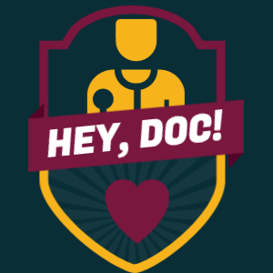

## Hey, Doc!

**This was created during my time as a student at Code Chrysalis**

**(このリポジトリはCode Chrysalisの生徒であるときに作成しました)**

## About
You can consult with doctors and aske questions from the comfort of your homes.

With Hey, Doc!, you can book a session, pay fee, and receive a confirm mail with Zoom link.

Our app is available [here](https://your-solution-front.vercel.app/).

## Repository
Front-end repository is [here](https://github.com/YoSoRyuShawn/your-solution-front).

Back-end repository is [here](https://github.com/YoSoRyuShawn/your-solution-back).

### Link

Our logo is created by <a href="https://www.designevo.com/jp/logo-maker/" title="無料オンラインロゴメーカー">DesignEvo</a>.
